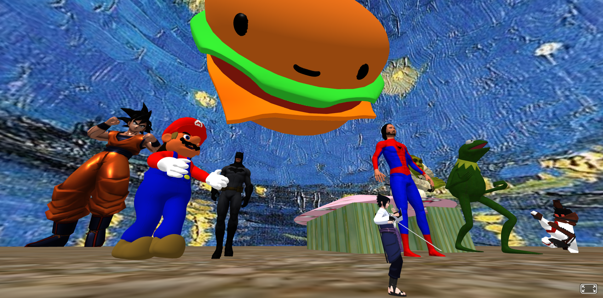

# Paraiso Aframe

O Paraíso é um ambiente calmo e tranquilo para você se distrair e sair um pouco da realidade.
Foi desenvolvido com intuito de descontração e aprendizado do framework [A-Frame](https://aframe.io/).

Para entrar clique aqui: [Paraiso](https://aframe-treino.vercel.app/)

### Informações Adicionais

Os modelos de personagens 3D foram obtidos no [Stetchfab](https://sketchfab.com/3d-models).

### Tecnologias Utilizadas

<table>
<tr>
	<th>Dependência</th>
	<th>Versão</th>

</tr>
<tr>
    <td>A-Frame</td>
    <td><a href="https://aframe.io/">https://aframe.io/</a></td>
</tr>
</table>

- Framework [A-Frame](https://aframe.io/)
- HTML

## 🚀 Instalação

No Terminal/Console:

<ol>
	<li>Faça um clone do projeto na sua máquina: <code>git clone https://github.com/thiag-o/paraiso-aframe.git</code></li>
	<li>Abra a pasta do projeto no VSCode</li> 
	<li>Instale e utilize a extensão <a href="https://marketplace.visualstudio.com/items?itemName=ritwickdey.LiveServer">Live Server</a>  </li>
	<li>Com a aplicação "de pé", clique aqui: <a href="http://localhost:5500">http://localhost:5500</a></li>
</ol>
